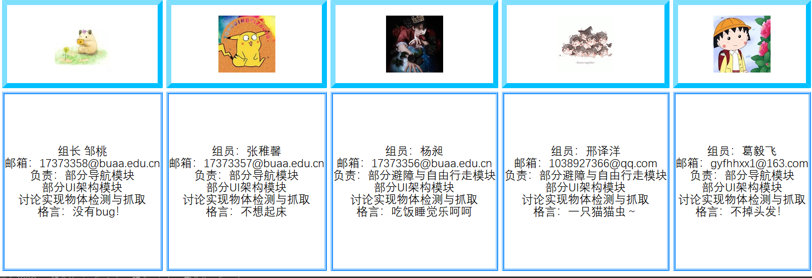

# sebuaa2020-Team108



### 项目结构

```
Team108:
  - code 		# 项目相关代码包及其使用简介、功能介绍
  - UI 			# 项目集成可视化界面
  - doc 		# 项目文档
  - img			# 图片
  - 参考书籍			 # ros启智机器人开发参考书籍
  - 演示 				  # 相关演示视频
```

详细内容见[项目wiki](https://github.com/sebuaa2020/Team108/wiki/)
